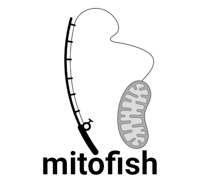

<p align="center">
  
</p>

# mitofish

This script generates "baited" sequences from across a provided genome to search for them in fastq file(s), which are then extracted out to a new fastq file for downstream processing.

This tool was designed initially to quickly pull mitochondrial reads from fastq files generated during live Nanopore sequencing runs. This was essentially fishing for mitochondrial reads, hence the name mitofish. However it should work for any reference sequences provided. At the end of the day it's just a bash wrapper utilising the amazing `seqkit grep` function.

## depends

For this script to run you need to have the tool `seqkit` (https://bioinf.shenwei.me/seqkit/) installed on the computer you are running on.

## usage

```
Usage: ./mitofish.sh [-t, --threads <threads> (optional)] [-g, --genome-size <genome_size>] [-b, --bait-length <bait_length> (optional)] 
      [-m, --mismatch <mismatch>] [-r, --reference <reference>] [-f, --fastq-input <fastq_input>] [-o, --output <output>]
```

The required input from the user is:

* `--genome-size` - the rough size of the mt genome (in base pairs) being used to create the bait sequences (doesn’t need to be exact).
* `--reference` - the reference mt genome in fasta format, this should be a mt genome closely related to the one you are trying to identify.
* `--fastq-input` - the path to a fastq, or set of fastq, files for reads to be extracted from.
* `--output` - the file you want to save the extracted reads to. This can be either fastq/fq (not compressed) or fastq.gz/fq.gz (compressed).

There are a few optional arguments. If you don’t provide any values for these the defaults will be used:

* `--threads` - the number of CPU threads to use in processing, (default: 4).
* `--bait-length` - the length of the bait sequences (in base pairs) being used to “pull out” the reads that match them, (default: 60).
* `--mismatch` - parameter passed to `seqkit grep` to determine the number of mismatches allowed in the sequence search term (the baits), (default: 3).

### example

Test data is available in the `test_data` directory. The below example will process this test yeast data set and extract potential mitochondrial reads based on a reference mitochondrial genome.

```sh
./mitofish.sh --genome-size 49300 \
  --reference ./test_data/test_reference.fasta \
  --fastq-input ./test_data/test_reads.fastq.gz \
  --threads 8 \
  --bait-length 30 \
  --output mitofish_results.fastq.gz
```

A successful run should generate the below output, identifying 57 potential mitochondrial reads.


### help

To display the help options: `./mitofish.sh --help`:

```
$ ./mitofish.sh --help
mitofish - version: 0.3dev
Usage: ./mitofish.sh [options]
Options:
  -h, --help          Show this help message and exit
  -t, --threads       [optional] Number of CPU threads to use for processing, default: 4
  -g, --genome-size   Approx size of the reference genome being used, example: 16500 (for mammalian mt genomes)
  -b, --bait-length   [optional] Length of bait sequence used for searching, default: 60
  -m, --mismatch      [optional] Number of mismatches to allow in the bait sequences, default: 3
  -r, --reference     Reference file to generate bait sequences
  -f, --fastq-input   Path to fq|fastq file to extract reads from
  -o, --output        File path for extracted reads to be written to
```
