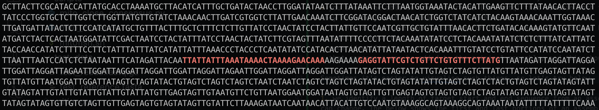
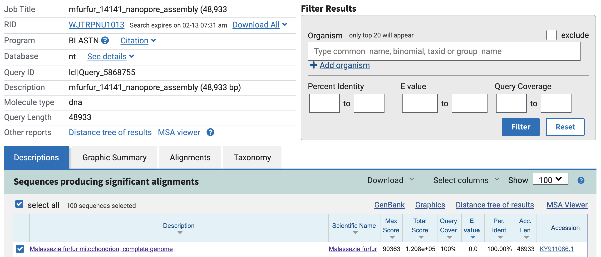

<p align="center">
  
</p>

# mitofish

This script generates "baited" sequences from across a provided genome to search for them in fastq file(s), which are then extracted out to a new fastq file for downstream processing.

This tool was designed initially to quickly pull mitochondrial reads from fastq files generated during live Nanopore sequencing runs. This was essentially fishing for mitochondrial reads, hence the name mitofish. However it should work for any reference sequences provided. At the end of the day it's just a bash wrapper utilising the amazing `seqkit grep` function.

## depends

For this script to run you need to have the tool `seqkit` ([https://bioinf.shenwei.me/seqkit/](https://bioinf.shenwei.me/seqkit/)) installed on the computer you are running on.

## usage

```sh
Usage: ./scripts/mitofish.sh [-t, --threads <threads> (optional)] [-g, --genome-size <genome_size>] [-b, --bait-length <bait_length> (optional)] 
      [-m, --mismatch <mismatch>] [-r, --reference <reference>] [-f, --fastq-input <fastq_input>] [-o, --output <output>]
```

The required input from the user is:

* `--genome-size` - the rough size of the mt genome (in base pairs) being used to create the bait sequences (doesn’t need to be exact).
* `--reference` - the reference mt genome in fasta format, this should be a mt genome closely related to the one you are trying to identify.
* `--fastq-input` - the path to a fastq, or set of fastq, files for reads to be extracted from.
* `--output` - the file you want to save the extracted reads to. This can be either fastq/fq (not compressed) or fastq.gz/fq.gz (compressed).

There are a few optional arguments. If you don’t provide any values for these the defaults will be used:

* `--threads` - the number of CPU threads to use in processing, (default: 4).
* `--bait-length` - the length of the bait sequences (in base pairs) being used to “pull out” the reads that match them, (default: 60).
* `--mismatch` - parameter passed to `seqkit grep` to determine the number of mismatches allowed in the sequence search term (the baits), (default: 3).

### example

Test data is available in the `test_data` directory. The below example will process this test yeast data set and extract potential mitochondrial reads based on a reference mitochondrial genome.

```sh
./scripts/mitofish.sh --genome-size 49300 \
  --reference ./test_data/test_reference.fasta \
  --fastq-input ./test_data/test_reads.fastq.gz \
  --threads 8 \
  --bait-length 30 \
  --output mitofish_results.fastq.gz
```

A successful run should generate the below output, identifying 57 potential mitochondrial reads.


### help

To display the help options: `./scripts/mitofish.sh --help` (make sure you are in the mitofish directory, or have mitofish in your path):

```sh
$ ./scripts/mitofish.sh --help
mitofish - version: 0.3dev
Usage: ./mitofish.sh [options]
Options:
  -h, --help          Show this help message and exit
  -t, --threads       [optional] Number of CPU threads to use for processing, default: 4
  -g, --genome-size   Approx size of the reference genome being used, example: 16500 (for mammalian mt genomes)
  -b, --bait-length   [optional] Length of bait sequence used for searching, default: 60
  -m, --mismatch      [optional] Number of mismatches to allow in the bait sequences, default: 3
  -r, --reference     Reference file to generate bait sequences
  -f, --fastq-input   Path to fq|fastq file to extract reads from
  -o, --output        File path for extracted reads to be written to
```

## auxilary scripts

I added a couple of extra scripts which are useful in trying to determine the "true" length of the mitochondrial genome, and in turn help close the circle. These are located in `./scripts/`:

* `mito_closer.py` - uses sequence from the start and end of an assembly to identify any sequence in between, which is useful for "closing" the genome (and providing a more accurate linear length).
  * >this script takes a mito assembly as input (fasta) and then uses 30bp from either end to try and locate sequence to help complete the genome and close the circle. It relies on the logic that if the mt is circular then if you take a selection from either end of a linear assembly they will either touch (nothing between them), or there will be an amount of sequence between them. This allows the true length to be determined and essentially closes the genome.
* `mito_close_consensus.py` - takes the fasta input from `mito_closer.py` and generates a consensus sequence, which can then be added to the original assembly (hopefully completing it).
  * >this script takes input fasta from mito_closer.py and finds a potential consensus sequence to complete the mitochondrial genome and close the loop. Consensus and reverse consensus are written out to fasta, and sequence that differs significantly is printed to stdout (with parent readID) for inspection.

### closing the circle

The basic logic behind the approach in the scripts above is as follows:

* if you have an assembly and it's not complete, then there must be sequence that still exists between the sequence at the "start" of the assembly and the "end" of the assembly.
  * Note: in this instance start and end are arbitrary as the mitochondrial genome is circular
* you should be able to identify reads (in fastq) that contain both the start and end sequences, as they must be joined eventually if the genome is circular.
* if this is the case then we can search for all reads that contain both the start and end sequences, as well as those that contain both the reverse compliment of them.
* once identified we can extract any sequence between these tagging sequences and create a consensus.
* that consensus can be added to the original assembly, and this should complete it.

Sometimes it's easier to visualise such things, so let's try below.

1. we identify a length of target start and end sequence from an assembly. I use 30bp, but this number can change. The below shows the first and last portions of an assembly `fasta` with 30bp highlighted (in red) at the extreme ends:


2. next we can search for reads that contain **both** of these target sequences (or their reverse compliments). It is important that the reads returned include both, this indicates that that read can help us close the loop.

Below you can see both start and end sequence in red, and in between you can see the bit of sequence that we are missing from our assembly. This appears to be `TTTTCTT`.


We need to remember to account for the reverse complement as well. Here is an example:



We can see that the sequence between the start and end targets is `AAGAAAA`, which is the reverse compliment to what we saw earlier. Great! This tells us that we have reads in our fastq file that contain our targets and have extra information to improve our assembly.

3. once we find all possible reads and extract this information we can try to create a consensus from the extracted sequences. Here is the output from the `mito_close_consensus.py` script for this example:

<!--  -->
```sh
❯ ~/gitrepos/mitofish/scripts/mito_close_consensus.py closer_output.fasta
Consensus sequence: TTTTCTT
Reverse complement of consensus sequence: AAGAAAA

Filtered out sequences (due to different lengths):
{'sequence': 'AGAAAA', 'info': ['parent_readID', '5548ca19-eb25-466b-a64e-832aa20dac2f', 'reverse', '35592', '35628']}
```

We can see that the consensus returned matches what we manually obseverd above. The script also reports any sequences that differ greatly from the majority. In this case there is a single sequence that was 1 base pair shorter than all the other sequences extracted. In this instance I chose to ignore this sequence and took the consensus that was 7 base pairs in length.

4. I took the consensus and added it to the original assembly, creating a "completed" assembly fasta file. When blasted this returned the following:



This turns out to be a perfect 100% match to a complete mitochondrial genome deposited in NCBI. In this instance this is confirmation that this approach has worked.

There are of course caveats with this method:

* genome assembly isn't something that I have done a lot of, and it's very possible that I'm missing a software tool/package that can do this nicely. I explored various bacterial tools to circularise genomes, but I couldn't get any of them working on these mitochondria. It's also very likely that adjusting the parameters to `flye` in the initial assembly stage could help out. Or maybe "massaging" the raw reads a little going into that assembly, as we have shown that the information is there, it's just not being incorporated into the final assembled genome.
* this assumes that the assembly is getting close to the "true" length of the mitochondiral genome, meaning that it has only been tested on situations where the "missing" sequence is small. I am not sure how well this would work in cases where the missing information was much longer. It should work in theory, but...
* if the length of the missing information is decently long, then there is a chance that a consensus might be harder to find due to potential errors. The consensus script is extremely basic and doesn't account for these, so I would advise a very manual approach to the final curation.
